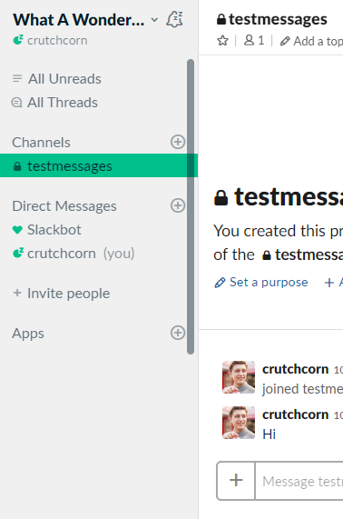

#  Maximum Slacktivity

This is a Chrome Extension that adds functionality and fixes issues with the Slack web application.

# Features

## Mobile (Small Screen) Improvements
- Adds a toggle for the channel list on mobile
- Allows the top bar to be horizontally scrollable
- Etc

<table border="0" width="100%">
 <tr>
    <td><h3 align="center">Before</h3></td>
    <td><h3 align="center">After</h3></td>
 </tr>
 <tr>
    <td></td>
    <td></td>
 </tr>
</table>
